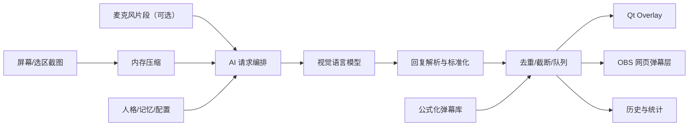

# AIEmotionDanmaku 产品需求文档（PRD）

版本：v1.0  
产品定位：面向直播、录屏、教学演示与游戏陪伴场景的本地 AI 情绪弹幕助手  
目标读者：AI 产品经理面试官、项目评审者、开发协作者

## 1. 摘要

AIEmotionDanmaku 是一款 Windows 桌面 AI 弹幕助手。产品通过本地 Web 控制台配置模型与人格，按固定节奏截取目标屏幕或选区，将画面上下文发送给视觉语言模型，生成短句弹幕，并通过透明置顶 Overlay 或 OBS 浏览器源实时上屏。可选麦克风模式会在用户说话结束后插入接话弹幕，增强直播间互动感。

本产品解决的是中小主播、教学演示者和内容创作者在“无人互动、冷场、转场空白、互动成本高”场景下的氛围补位问题。相较普通聊天机器人，AIEmotionDanmaku 的核心差异在于：以实时视觉上下文为输入、以弹幕上屏为输出、以本地隐私与可控模型为产品边界，并通过人格、记忆、公式化弹幕库、去重与节奏控制保障生成质量。

北极星指标：每有效运行分钟产生的“可上屏、强相关、非重复”弹幕数。

## 2. 背景与机会

### 2.1 用户痛点

1. 小主播或新账号直播间互动稀少，画面变化无人接话，观看氛围弱。
2. 主播需要同时操作游戏、演示、讲解和回复评论，人工制造弹幕氛围成本高。
3. 通用大模型聊天机器人缺少画面感知，容易输出脱离场景的泛泛评论。
4. 直播内容常包含隐私窗口、账号信息和本地文件，用户不愿把完整工作流迁移到云端。
5. AI 生成弹幕如果太长、重复、延迟或风格不统一，会破坏观看体验。

### 2.2 产品机会

直播和录屏工具正在从“采集与推流”向“智能陪伴与内容增强”扩展。弹幕是一种低侵入、强氛围的互动载体，适合由 AI 在画面侧实时生成短文本。AIEmotionDanmaku 将“屏幕理解、短文本生成、弹幕渲染、本地配置、模型可替换”组合成轻量桌面工具，能够成为创作者工作台中的 AI 互动层。

### 2.3 替代方案与差异化

| 替代方案 | 局限 | AIEmotionDanmaku 差异化 |
|----------|------|--------------------------|
| OBS 弹幕插件 | 主要展示真实评论，不解决冷启动无人互动 | 由 AI 基于当前画面生成氛围弹幕 |
| 通用聊天机器人 | 缺少屏幕上下文，输出难以上屏 | 以截图/选区为核心输入，输出天然面向弹幕 Overlay |
| 云端直播助手 | 接入重、隐私压力大、模型选择受限 | 本地控制台、本地配置、本地渲染，用户自选模型供应商 |
| 人工运营弹幕 | 成本高且无法 24 小时稳定陪伴 | 固定节奏生成，支持本地短句池补位 |
| 简单 Prompt 原型 | 缺少工程稳定性和质量闭环 | 具备解析、去重、退避、统计、日志与 OBS 接入 |

## 3. 目标与非目标

### 3.1 产品目标

1. 在低互动直播间中持续补充自然、短促、有画面感的弹幕。
2. 让用户在 5 分钟内完成模型配置、屏幕选择、人格选择和首次上屏。
3. 在本地优先的隐私边界内提供可控、可解释、可调试的 AI 生成链路。
4. 通过多模型供应商、自定义模型和压缩预览降低接入成本与失败率。
5. 建立可量化的质量闭环：生成成功率、解析成功率、重复率、延迟、Token 消耗和运行时长。

### 3.2 非目标

1. 不做直播平台账号系统、云端同步或多人协作后台。
2. 不替代真实观众评论，不伪造平台互动数据。
3. 不做全量直播间运营套件，例如礼物管理、房管、切片分发。
4. 不在默认流程中落盘截图、音频或完整模型请求体。
5. 不追求复杂多角色对话，优先保证弹幕短、快、稳、相关。

## 4. 目标用户与核心场景

| 用户 | 场景 | 关键需求 |
|------|------|----------|
| 中小主播 | 游戏、才艺、杂谈直播冷启动 | 自动补充捧场、吐槽、接话弹幕，降低冷场 |
| 教学/演示创作者 | 代码、PPT、软件操作录屏 | 生成画面相关的轻评论，提升录屏节奏 |
| 游戏陪伴用户 | 单机或联机时需要氛围感 | 让 AI 像观众一样围观当前画面 |
| AI 工具尝鲜用户 | 对比不同视觉模型效果 | 快速切换供应商、模型、提示词和人格 |
| 运营/产品演示者 | 需要可控的展示氛围 | OBS 浏览器源接入，便于推流与演示 |

## 5. 用户旅程

1. 首次启动：用户运行桌面应用，进入本地 Web 控制台。
2. 接入模型：选择服务商预设或自定义 OpenAI 兼容模型，填写 API Key，执行连接测试。
3. 配置画面：选择显示器或框选识图区域，使用图像压缩预览理解成本与清晰度。
4. 配置风格：选择内置人格，或在“人格工坊”调整提示词、查看历史版本。
5. 开始生成：点击开始后，系统按固定间隔截图并生成固定条数弹幕。
6. 实时上屏：弹幕进入 FIFO 队列，经去重、截断和轨道选择后显示在 Qt Overlay；OBS 可通过浏览器源同步显示。
7. 运行调优：用户查看状态、日志、场次记录、Token 消耗，调整间隔、模型、人格、记忆和本地弹幕库。
8. 停止复盘：结束后沉淀运行统计，为后续成本和效果优化提供依据。

## 6. MVP 范围

### 6.1 P0：核心闭环

| 模块 | 需求 | 验收标准 |
|------|------|----------|
| 本地控制台 | 使用 Web UI 管理启动、停止、配置、状态和日志 | 默认 `python main.py` 进入 Web 控制台 + pywebview 桌面壳 |
| 屏幕识别 | 支持目标屏幕截图、局部区域裁剪、内存压缩 | 有效截图才触发请求；截图默认不落盘 |
| AI 生成 | 支持豆包 Responses 与 OpenAI 兼容接口 | 请求固定关闭 thinking；流式只收集正文内容 |
| 输出契约 | 每批生成固定条数短弹幕 | 回复解析后为合法短文本数组，超长自动截断 |
| 弹幕上屏 | 透明置顶 Overlay 横向滚动显示 | 多轨道显示，避免明显碰撞与高重复 |
| 稳定性 | 请求在后台线程执行，主线程只负责 Qt 对象 | HTTP 线程不得直接修改 Qt 对象 |
| 错误保护 | 连续失败退避，鉴权/额度错误立即暂停 | 日志能说明失败原因，避免 API 连续打爆 |

### 6.2 P1：体验与增长能力

| 模块 | 需求 | 产品价值 |
|------|------|----------|
| 人格工坊 | 内置多种人格，支持自定义提示词、版本预览与回滚 | 让用户调出“像自己直播间”的语气 |
| 模型目录 | 提供多服务商预设、模型目录、价格元数据和自定义模型 | 降低 API 接入门槛，支持成本比较 |
| 公式化弹幕库 | 内置/自定义短句池，同屏不足时补足 | 避免空屏，控制直播氛围底噪 |
| 记忆模式 | 支持 off、dedup_only、scene_card、strong | 提升连续画面理解与去重表现 |
| 麦克风插入 | 检测说话结束后用截图 + 音频生成接话弹幕 | 让 AI 对主播语音做轻量互动 |
| OBS 网页层 | 提供透明网页弹幕层和 SSE 推送 | 支持直播软件浏览器源接入 |
| 运行统计 | 会话统计、累计弹幕数、运行时长、Token 消耗 | 帮助用户评估效果与成本 |

### 6.3 P2：规模化与商业化探索

1. 新手引导：模型接入向导、隐私提醒、首条弹幕示例。
2. 效果评分：用户对弹幕进行“相关/无关/重复/冒犯”轻反馈。
3. 成本面板：按模型估算每小时成本，提供低成本推荐策略。
4. 英文 i18n：面向海外创作者扩展 UI 与默认人格。
5. 安全策略：敏感画面提醒、关键词拦截和内容分级。
6. A/B 实验：对比不同人格、记忆模式和识图间隔对有效弹幕率的影响。

## 7. AI 能力设计

### 7.1 输入

| 输入 | 来源 | 用途 |
|------|------|------|
| 屏幕截图 | 目标显示器或选区 | 识别当前画面主体、动作、界面状态 |
| 麦克风片段 | 可选，语音端点检测后触发 | 生成接话型弹幕 |
| 人格提示词 | 内置或自定义 | 控制语气、角色、弹幕风格 |
| 记忆上下文 | 进程内短期记忆 | 避免重复、保留场景状态 |
| 公式化弹幕库 | 内置/自定义短句 | AI 不足或同屏不足时补位 |
| 运行配置 | 条数、间隔、模型、温度、Token | 控制成本、节奏和输出稳定性 |

### 7.2 生成策略

1. 输出必须是短文本数组，不输出解释、Markdown 或多余字段。
2. 每批前 1–2 条必须强相关当前截图，后续弹幕可承担直播间氛围补位。
3. 中文单条控制在 15 字以内，英文单条控制在 40 字符以内。
4. 模型请求关闭思考内容，避免 `reasoning_content` 被误当弹幕。
5. 使用解析器标准化回复，对空解析、超长、重复、非法格式进行兜底处理。
6. 使用近 30 条弹幕窗口与 Levenshtein 相似度降低重复感。

### 7.3 模型策略

| 策略 | 原因 |
|------|------|
| 多供应商预设 | 降低单一 API 不可用风险，方便用户按成本和质量选择 |
| OpenAI 兼容适配 | 复用生态能力，支持百炼、硅基流动、MiMo 等平台 |
| 豆包 Responses 适配 | 支持流式视觉与麦克风音频输入 |
| 模型目录 + 价格元数据 | 将“选模型”从技术配置转为产品化决策 |
| 自定义模型 CRUD | 服务高级用户和私有部署场景 |

### 7.4 质量评估

| 维度 | 定义 | 观测方式 |
|------|------|----------|
| 相关性 | 弹幕能否对应当前画面 | 用户反馈、人工抽检、强相关槽位命中 |
| 时效性 | 弹幕是否在画面过期前出现 | API RTT、队列等待、上屏延迟 |
| 多样性 | 是否避免连续重复和模板感 | 近窗重复率、相似度分布 |
| 安全性 | 是否避免攻击、隐私、敏感内容 | Prompt 约束、关键词规则、反馈标注 |
| 成本 | 每小时 Token 与 API 调用成本 | Token 统计、模型价格元数据 |
| 稳定性 | 是否能长时间运行不中断 | 成功率、失败退避次数、崩溃率 |

## 8. 指标体系

### 8.1 激活指标

| 指标 | 目标 |
|------|------|
| 首次启动成功率 | 用户运行后能打开控制台 |
| 首次模型连接成功率 | API Key 与模型配置通过 probe |
| 首条弹幕生成耗时 | 从点击开始到第一条上屏 |
| 新手配置完成率 | 完成模型、屏幕、人格基础配置 |

### 8.2 运行指标

| 指标 | 目标 |
|------|------|
| AI 请求成功率 | 正常返回且可解析 |
| 空解析率 | 越低越好，直接反映 Prompt 与模型适配 |
| P95 上屏延迟 | 控制在直播可接受范围 |
| 有效弹幕/分钟 | 北极星指标的运行版本 |
| 重复弹幕率 | 低于可感知重复阈值 |
| 每小时 Token 消耗 | 用于成本优化 |

### 8.3 体验指标

| 指标 | 目标 |
|------|------|
| 人格留存率 | 用户是否持续使用某一人格 |
| 手动调参次数 | 过高说明默认配置不够好 |
| OBS 接入成功率 | 直播软件场景的关键可用性 |
| 停止后复开率 | 反映用户是否愿意长期使用 |

## 9. 信息架构

| 页面 | 核心任务 |
|------|----------|
| 运行概览 | 启停生成、查看状态、会话统计、直播输出、诊断信息 |
| 助手设置 | 配置模型、识图节奏、屏幕/选区、压缩、温度和记忆 |
| 公式化弹幕库 | 管理内置/自定义短句池和同屏补足策略 |
| 人格工坊 | 编辑提示词、管理内置/自定义人格、版本回滚 |
| 弹幕日志 | 查看生成记录、错误和过滤结果 |
| 公告与反馈 | 发布说明、问题反馈和用户沟通入口 |

## 10. 架构与数据流

关键设计原则：

1. 截图在 Qt 主线程，AI 请求在 QThreadPool，避免 UI 阻塞。
2. Web API 通过 bridge 信号将配置变更交回主线程，避免跨线程直接操作 Qt 对象。
3. FastAPI 只监听 `127.0.0.1`，写操作需要 Bearer token。
4. 配置与密钥存储在本地 SQLite，API Key 优先 Fernet 加密。
5. 日志脱敏 API Key、Bearer Token、长 Base64 图片和音频。

## 11. 隐私与安全

| 风险 | 方案 |
|------|------|
| 屏幕包含敏感信息 | 提供屏幕选择、区域裁剪、显著隐私提醒 |
| 截图外发给模型供应商 | 默认不落盘，明确提示用户选择可信模型服务 |
| API Key 泄露 | 本地加密存储，GET 接口返回掩码 Key |
| 日志泄露请求体 | 日志脱敏，不记录完整截图、音频和原始请求体 |
| Web 控制台被局域网访问 | 仅绑定 127.0.0.1，写操作需要 token |
| AI 输出冒犯性弹幕 | Prompt 禁止项、后处理过滤、后续可加入用户反馈闭环 |

## 12. 风险与应对

| 风险 | 影响 | 应对 |
|------|------|------|
| 模型看图能力差异大 | 弹幕相关性不稳定 | 模型目录、默认推荐、连接测试、质量提示 |
| 延迟过高 | 弹幕过期，影响观感 | 单请求 in-flight、压缩、固定节奏、过期元数据 |
| 生成内容模板化 | 用户感到假、重复 | 人格工坊、记忆模式、公式库去重、相似度过滤 |
| 成本不可控 | 用户不敢长期开启 | 间隔配置、Token 统计、成本估算与低价模型推荐 |
| 跨线程状态错误 | 崩溃或配置不一致 | WebConsoleBridge、主线程应用配置、测试覆盖 |
| 隐私疑虑 | 阻碍真实使用 | 本地优先、默认不落盘、隐私文档和选区能力 |

## 13. 发布计划

| 阶段 | 目标 | 交付 |
|------|------|------|
| Alpha | 打通截图到弹幕上屏主链路 | Web 控制台、Overlay、模型配置、日志 |
| Beta | 面向创作者可用 | 人格工坊、模型目录、公式化弹幕库、OBS 层 |
| Public Preview | 降低使用门槛 | 新手引导、成本面板、反馈闭环、打包分发 |
| Growth | 拓展人群与场景 | 英文 UI、更多模型适配、直播平台模板、效果实验 |

## 14. 后续路线图

1. 新手引导：将 API 配置、屏幕选择、隐私提醒和首条测试弹幕串成 3 步向导。
2. 成本可视化：按模型目录估算每小时费用，结合压缩和间隔给出推荐。
3. 弹幕质量反馈：支持对日志中的弹幕标记“好/无关/重复/不安全”，沉淀评估集。
4. 更强安全层：加入敏感词、隐私窗口提示和可配置的输出风控等级。
5. 跨语言体验：补齐英文 UI、人设和短句库，面向海外直播工具生态。
6. 高 DPI 与动画优化：提升多屏、不同缩放比例下的 Overlay 稳定性。
